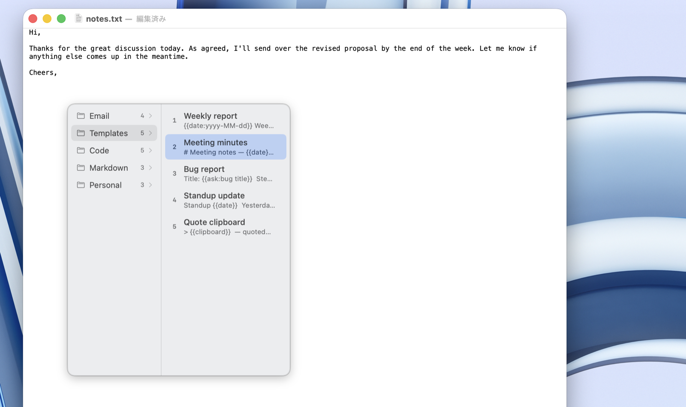

# Tattan（タッタン）

**タッ、タン！** 右 ⌘ キーを二度押しすると、クリップボード履歴がポンと出てくる。

Tattan は macOS ネイティブの無料クリップボード／スニペット管理アプリ。名前の由来は、右⌘二度押しの音。Swift + SwiftUI 製で、iCloud で複数の Mac 間を同期。MIT ライセンスの OSS として公開しています。

[English README is here](README.md)


## 機能

- 📋 **クリップボード履歴** — テキスト・画像・RTF・ファイルパスを自動でキャプチャ
- ⌨️ **どこでも呼び出し** — 右⌘の二度押し（変更可）で表示。矢印キー・数字キー 1〜9/0・マウスでペースト
- 📝 **スニペット** — よく使う定型文をグループで整理。スニペット単位のホットキーも設定可
- 🔧 **テンプレート変数** — `{{date}}` `{{time}}` `{{clipboard}}` `{{ask}}` などをペースト時に展開
- ☁️ **iCloud 同期** — スニペットと履歴が Mac 間で同期（巨大な項目とカード番号検知項目はこの Mac から出ません）
- 🔒 **プライバシー配慮** — パスワードマネージャーからのコピーは保存しない。クレジットカード風の番号はマスク表示 + ローカル専用保存
- 🚫 **除外アプリ** — 特定のアプリを履歴の対象外にできる
- 🎨 **カラープレビュー** — カラーコードをコピーすると一覧に色の丸が出る
- 🌗 **ネイティブな見た目** — メニューバー常駐、ライト/ダーク完全対応、日英ローカライズ

## 動作環境

- macOS 26（Tahoe）以降
- Apple Silicon

## インストール

[Releases](https://github.com/khamsin-inc/tattan/releases/latest) から最新の DMG をダウンロードして開き、Tattan を Applications にドラッグしてください。

初回起動時に、右⌘二度押しの検知と自動ペーストに必要なアクセシビリティ権限の許可を求めます。

Homebrew Cask 対応も予定しています。

## 使い方

| 操作 | 方法 |
|---|---|
| ポップアップを開く | 右⌘を二度押し |
| ペースト | クリック、または数字キー（1〜9、0 = 10 件目）、または ↑↓ + Return |
| 履歴 / スニペット切替 | Tab |
| スニペットのグループを開く | ←→ で出入り |
| 履歴をスニペット化 | 右クリック → 「スニペットとして保存…」 |
| 設定 | メニューバーアイコン → 「設定…」 |



ユーザーマニュアル: [khamsin.jp/products/tattan/manual](https://khamsin.jp/products/tattan/manual/)

## プライバシー

Tattan は Mac の中だけで完結します。外部通信は iCloud 同期（あなた専用の CloudKit プライベートデータベース）と Sparkle のアップデート確認のみ。アクセス解析・テレメトリー・サードパーティサーバーは一切ありません。

## ソースからビルド

```bash
brew install xcodegen swiftlint
git clone https://github.com/khamsin-inc/tattan.git
cd tattan
xcodegen generate
open Tattan.xcodeproj
```

Xcode プロジェクトは `project.yml` から生成します。ファイルを追加したら `xcodegen generate` を再実行してください。CI では `swiftlint --strict` と警告ゼロビルドを強制しています。

## ライセンス

[MIT](LICENSE) © Khamsin
