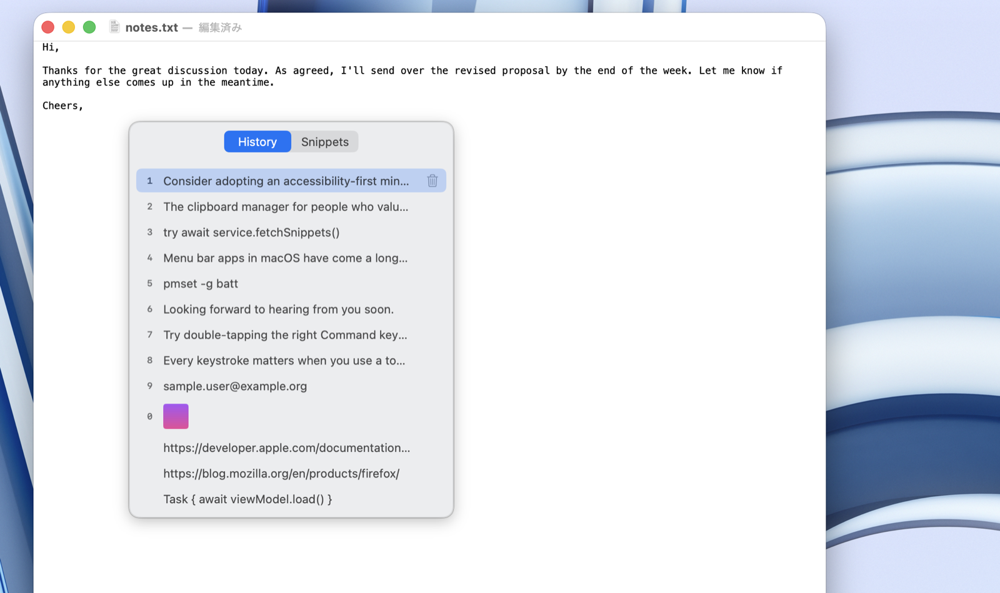

# Tattan

**Tat, tan!** Double-tap right ⌘ and your clipboard history pops up.

Tattan is a free, native clipboard & snippet manager for macOS, named after the Japanese onomatopoeia for that double-tap sound. Built with Swift + SwiftUI, synced across your Macs via iCloud, and released as open source under the MIT license.

[日本語の README はこちら](README.ja.md)

<!-- TODO: hero screenshot

-->

## Features

- 📋 **Clipboard history** — text, images, RTF, and file paths, captured automatically
- ⌨️ **Summon anywhere** — double-tap right ⌘ (customizable) and paste with arrow keys, digits 1–9/0, or the mouse
- 📝 **Snippets** — reusable text organized in groups, with per-snippet hotkeys
- 🔧 **Template variables** — `{{date}}`, `{{time}}`, `{{clipboard}}`, `{{ask}}` and more, expanded at paste time
- ☁️ **iCloud sync** — snippets and history follow you across Macs (oversized items and detected card numbers never leave the Mac)
- 🔒 **Privacy-aware** — passwords from password managers are never stored; credit-card-like numbers are masked and kept local-only
- 🚫 **App exclusion** — tell Tattan to ignore specific apps entirely
- 🎨 **Color preview** — hex color codes show a color dot in the list
- 🌗 **Native look** — menu bar app with full light/dark support, English and Japanese localization

## Requirements

- macOS 26 (Tahoe) or later
- Apple Silicon

## Install

Download the latest DMG from [Releases](https://github.com/khamsin-inc/tattan/releases/latest), open it, and drag Tattan to Applications.

On first launch, Tattan asks for the Accessibility permission it needs to watch for the right-⌘ double tap and to paste for you.

A Homebrew Cask is planned.

## Usage

| Action | How |
|---|---|
| Open the popup | Double-tap right ⌘ |
| Paste an item | Click it, or press its number (1–9, 0 = 10th), or ↑↓ + Return |
| Switch history / snippets | Tab |
| Browse snippet groups | ←→ to enter/leave a group |
| Save a history item as a snippet | Right-click → *Save as Snippet…* |
| Settings | Menu bar icon → *Settings…* |

The user manual lives at [khamsin.jp/en/products/tattan/manual](https://khamsin.jp/en/products/tattan/manual/).

## Privacy

Tattan runs entirely on your Mac. The only network traffic is iCloud sync (your private CloudKit database) and the Sparkle update check. No analytics, no telemetry, no third-party servers.

## Building from source

```bash
brew install xcodegen swiftlint
git clone https://github.com/khamsin-inc/tattan.git
cd tattan
xcodegen generate
open Tattan.xcodeproj
```

The Xcode project is generated from `project.yml`; run `xcodegen generate` again whenever you add files. CI enforces `swiftlint --strict` and a warning-free build.

## License

[MIT](LICENSE) © Khamsin
